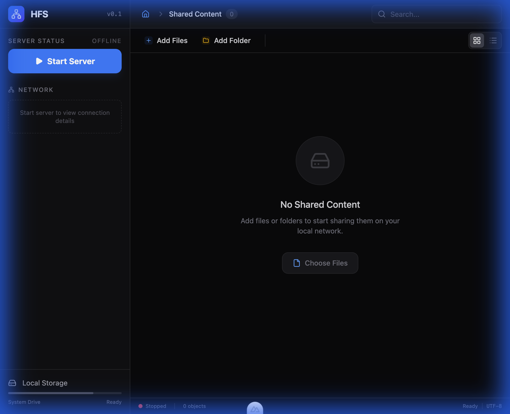
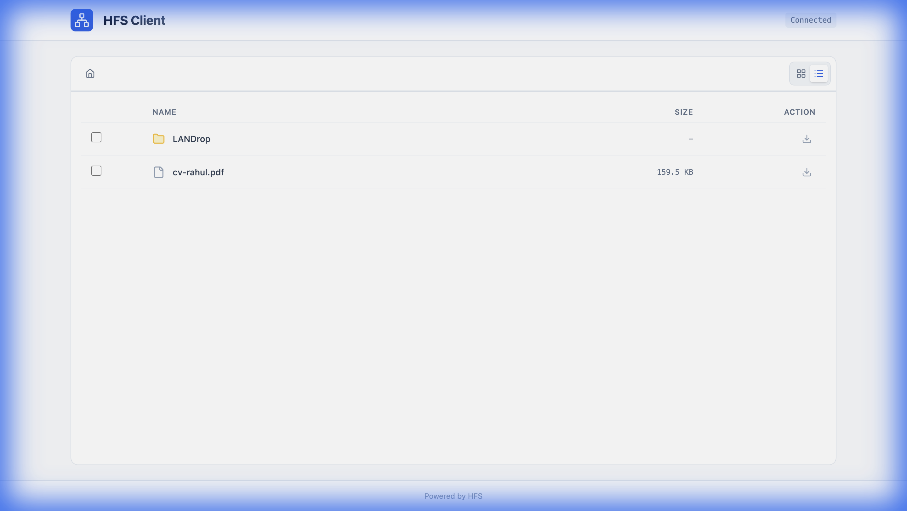

# 🌐 HFS – HTTP File Share

**Share files instantly over your local network. No cloud. No accounts. Just drop and go.**

[📥 Download for macOS](#download) • [📥 Download for Windows](#download) • [📥 Download for Linux](#download)

---

## ✨ Features

| Feature | Description |
|---------|-------------|
| 🚀 **One-Click Sharing** | Select files or folders and start sharing instantly |
| 🌍 **LAN Access** | Anyone on your network can download via browser |
| 📦 **Zip Downloads** | Download entire folders or multiple files as ZIP |
| 🎨 **Modern UI** | Beautiful, professional dark-themed interface for both server and client |
| 🔒 **Private & Secure** | No internet required, files never leave your network |
| ⚡ **Lightweight** | Built with Rust + Tauri for blazing fast performance |

---

## 📸 Screenshots

### Server Dashboard
*Control your file server with an intuitive dark-themed interface*

### Client Interface  
*Recipients browse and download files through a clean, dark-themed web UI*

---

## 📥 Download {#download}

Download the latest release for your platform:

| Platform | Download |
|----------|----------|
| **macOS (Apple Silicon)** | [Download .dmg](https://github.com/rahuldholehfs/releases/latest/download/HFS_aarch64.dmg) |
| **macOS (Intel)** | [Download .dmg](https://github.com/rahuldholehfs/releases/latest/download/HFS_x64.dmg) |
| **Windows** | [Download .msi](https://github.com/rahuldholehfs/releases/latest/download/HFS_x64.msi) |
| **Linux (Debian/Ubuntu)** | [Download .deb](https://github.com/rahuldholehfs/releases/latest/download/HFS_amd64.deb) |
| **Linux (AppImage)** | [Download .AppImage](https://github.com/rahuldholehfs/releases/latest/download/HFS_amd64.AppImage) |

> 💡 **Note**: Replace `rahuldholehfs` with your actual GitHub repository path.

---

## 🚀 Quick Start

1. **Download & Install** – Get the app for your platform above
2. **Add Files** – Click "Add Files" or "Add Folder" to select content
3. **Start Server** – Click the blue "Start Server" button
4. **Share the Link** – Copy the LAN URL and send it to recipients
5. **Done!** – They can browse and download directly from their browser

---

## 🛠️ Tech Stack

- **Frontend**: [Nuxt 4](https://nuxt.com) + [Vue 3](https://vuejs.org) + [Tailwind CSS](https://tailwindcss.com)
- **Backend**: [Rust](https://rust-lang.org) + [Axum](https://github.com/tokio-rs/axum)
- **Desktop**: [Tauri 2](https://tauri.app)
- **Icons**: [Lucide](https://lucide.dev)

---

## 🤝 Contributing

Contributions are welcome! Please read [MAINTENANCE.md](MAINTENANCE.md) for development setup.

---

## 📄 License

MIT License – see [LICENSE](LICENSE) for details.

---

**Made with ❤️ for local file sharing**

