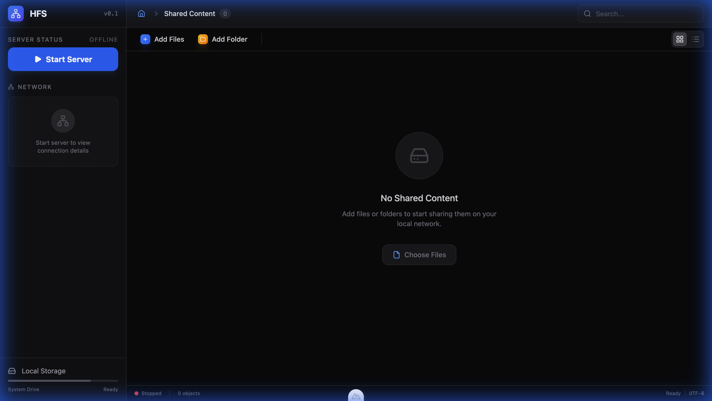
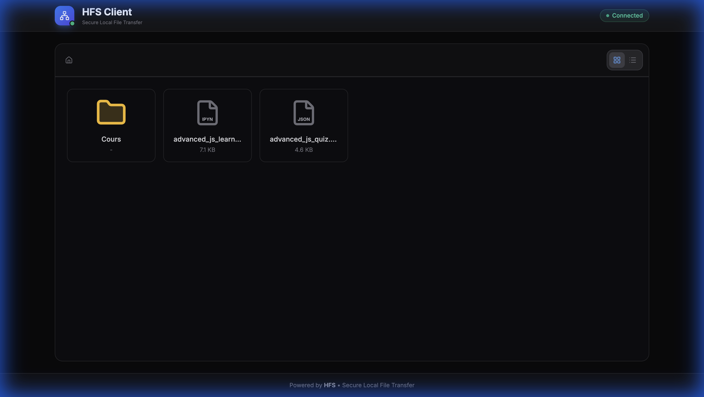

# 🌐 HFS – HTTP File Share

**Share files instantly over your local network. No cloud. No accounts. Just drop and go.**

[📥 Download for macOS](#📥-download) • [📥 Download for Windows](#📥-download) • [📥 Download for Linux](#📥-download)

---

## 📥 Download

Get the official release for your operating system:

| Platform | Recommended Package |
|----------|----------|
| **macOS (Apple Silicon)** | [Download .dmg](https://github.com/rahuldhole/hfs/releases/latest/download/HFS_aarch64.dmg) |
| **macOS (Intel)** | [Download .dmg](https://github.com/rahuldhole/hfs/releases/latest/download/HFS_x64.dmg) |
| **Windows** | [Download .msi](https://github.com/rahuldhole/hfs/releases/latest/download/HFS_x64.msi) |
| **Linux (Debian/Ubuntu)** | [Download .deb](https://github.com/rahuldhole/hfs/releases/latest/download/HFS_amd64.deb) |
| **Linux (AppImage)** | [Download .AppImage](https://github.com/rahuldhole/hfs/releases/latest/download/HFS_amd64.AppImage) |

> [!TIP]
> ### 🍎 macOS Note
> Since this is an open-source application without formal code signing, macOS may show a security warning. To run it:
> 1. Right-click the `.dmg` file → **Open**
> 2. Click **Open** in the security dialog
> 3. Alternatively, run: `sudo xattr -cr /Applications/HFS.app`

---

### "Finally, a way to move files between my laptop and PC without a USB drive or cloud overhead."

## ✨ Why HFS?

HFS is a lightweight, blazing-fast local file sharing utility. It turns your computer into a temporary file server that anyone on your Wi-Fi can access via their browser—no app installation required for recipients.

| Feature | Why it matters |
|---------|-------------|
| 🚀 **One-Click Sharing** | No complex setup. Select, start, share. |
| 🌍 **Universal Access** | Works on any device with a browser: Phones, Tablets, TVs, PCs. |
| 📦 **Batch Downloads** | Recipients can grab entire folders as a single ZIP. |
| 🎨 **Modern Experience** | A sleek, professional UI that feels like a premium app. |
| 🔒 **Total Privacy** | Files never leave your local network. No tracking, no logs. |
| ⚡ **Near-Native Speed** | Built with Rust/Tauri for minimal footprint and maximum performance. |

---

## 📸 See it in action

### Control Center (Server)
*Manage your shared content with ease*

### Recipient View (Client)
*A beautiful, responsive web interface for downloading*

---

## 🚀 Get Started in Seconds

1. **Download & Install** – Get HFS for your platform [below](#📥-download).
2. **Add Content** – Drag & drop or use the "Add" buttons to select files/folders.
3. **Go Live** – Click "Start Server".
4. **Share the Link** – Send the generated LAN URL to anyone on your network.
5. **Done!** – They browse and download immediately.

---

  <h3>🛠️ Developer Resources</h3>

## ⚙️ Tech Stack

HFS is built with modern, high-performance technologies:
- **Core**: [Rust](https://rust-lang.org) with [Axum](https://github.com/tokio-rs/axum) for the web server.
- **UI Framework**: [Nuxt 4](https://nuxt.com) + [Vue 3](https://vuejs.org) + [Tailwind CSS](https://tailwindcss.com).
- **Desktop Bridge**: [Tauri 2](https://tauri.app).
- **Iconography**: [Lucide](https://lucide.dev).

## 🛠️ Development Setup

If you want to build HFS from source or contribute:

1. Clone the repo: `git clone https://github.com/rahuldhole/hfs.git`
2. Install dependencies: `pnpm install`
3. Run in dev mode: `pnpm tauri dev`

For more detailed instructions, see [MAINTENANCE.md](MAINTENANCE.md).

## 🤝 Contributing

We love contributions! Whether it's a bug fix, feature request, or documentation improvement, please feel free to open a PR.

## 📄 License

Distributed under the MIT License. See [LICENSE](LICENSE.md) for more information.

---

**Built with ❤️ by [Rahul Dhole](https://rahuldhole.com)**  
*Making local file sharing simple again.*

